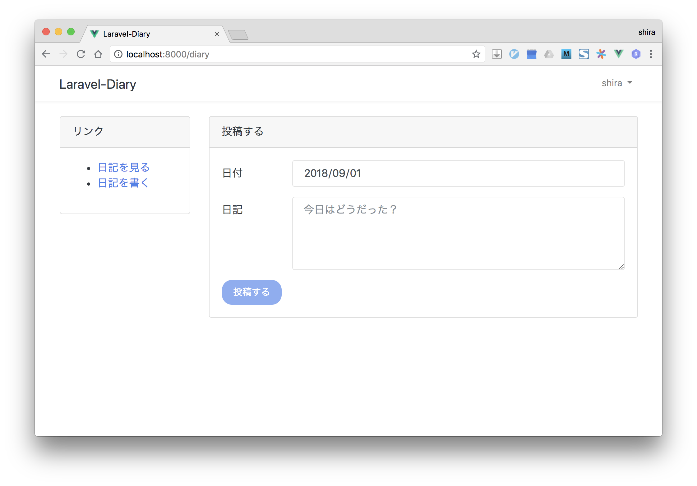
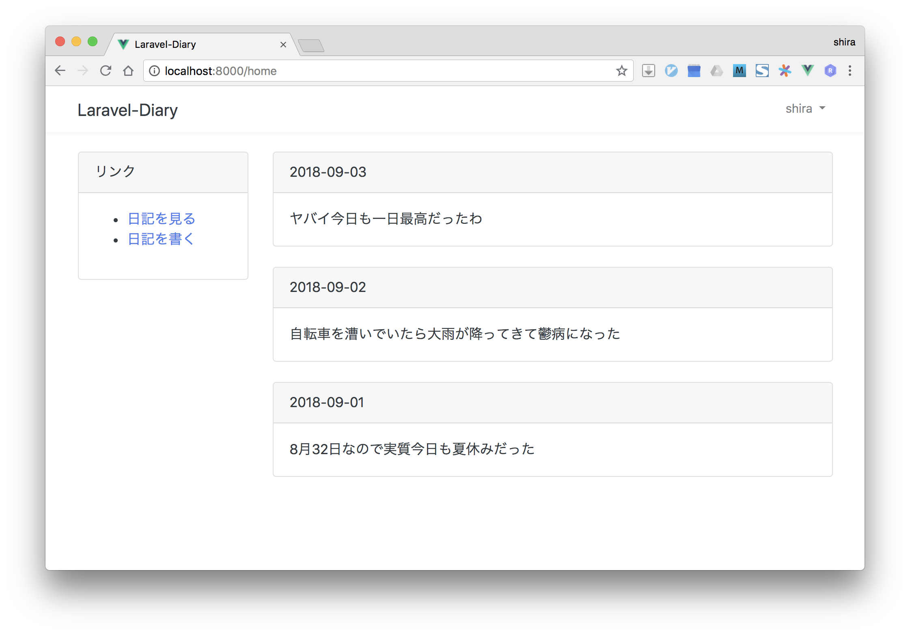

# laravel-diary
日記アプリ(laravelの練習)




## 導入手順
```
touch database/database.sqlite
touch database/database_test.sqlite
cp .env.example .env
php artisan migrate
npm install
```
## ビルド&実行
```
npm run dev
php artisan serve
```
